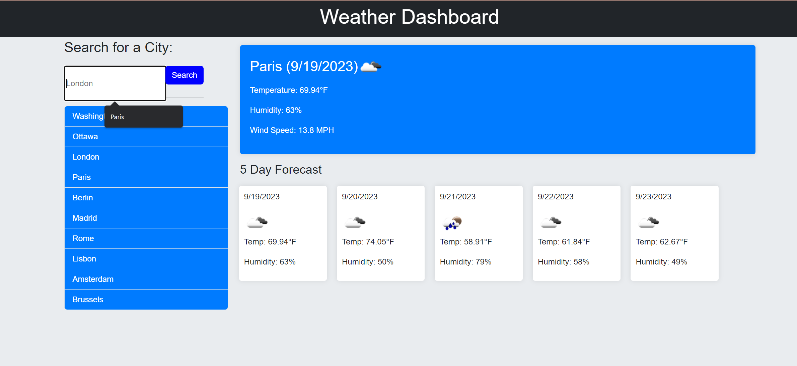

# Weather Dashboard

## Overview

The Weather Dashboard is a web application designed to provide users with current weather conditions and a 5-day forecast for any city. It offers a user-friendly interface and accurate weather data sourced from the OpenWeatherMap API.

## Features

- **Current Weather**: Displays the current temperature, humidity, wind speed, and weather icon for the selected city.
- **5-Day Forecast**: Provides a forecast for the next five days, including temperature, humidity, and weather icons.
- **City Search**: Allows users to search for a city and view its weather details.
- **Responsive Design**: The dashboard is optimized for both desktop and mobile devices.

## Live Demo

Experience the Weather Dashboard live [here](https://bh1ff.github.io/WeatherDashboard).

## Repository

The source code for the Weather Dashboard is hosted on GitHub and can be accessed [here](https://github.com/bh1ff/WeatherDashboard).

## Feedback & Contributions

For feedback, issues, or contributions, please reach out to:

- **Email**: [a.ayad@robocode.uk](mailto:a.ayad@robocode.uk)
- **GitHub**: [bh1ff](https://github.com/bh1ff)

## License

This project is licensed under the MIT License. See the [LICENSE](https://github.com/bh1ff/WeatherDashboard/blob/main/LICENSE) file for details.
